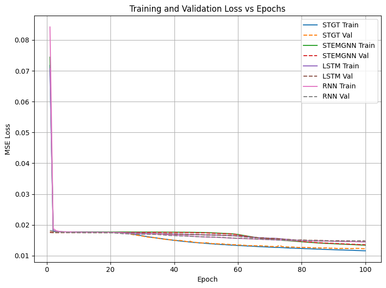
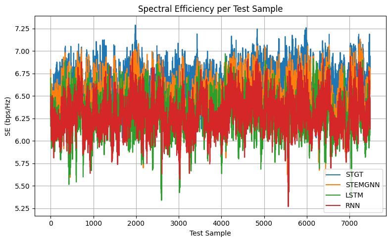
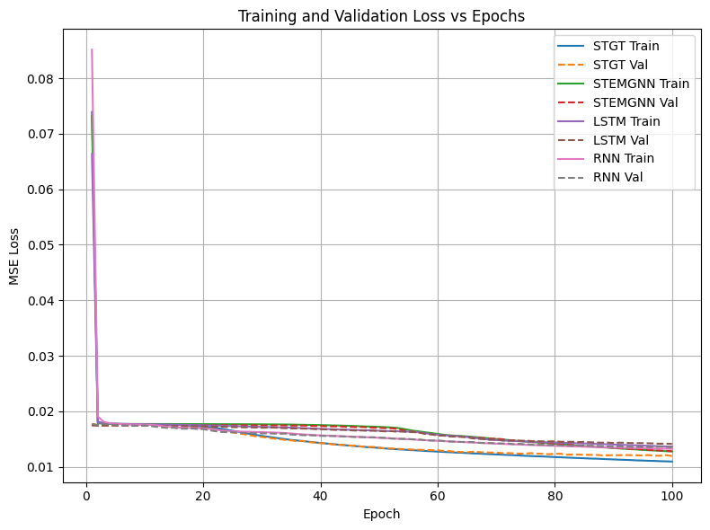
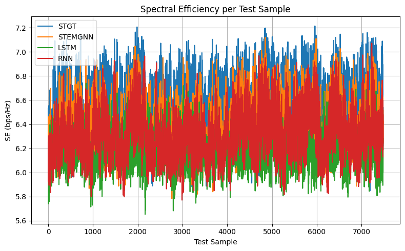
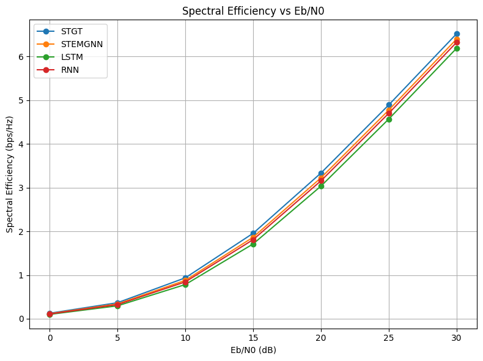
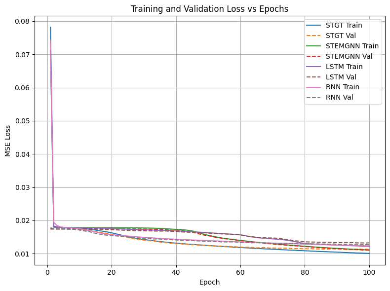
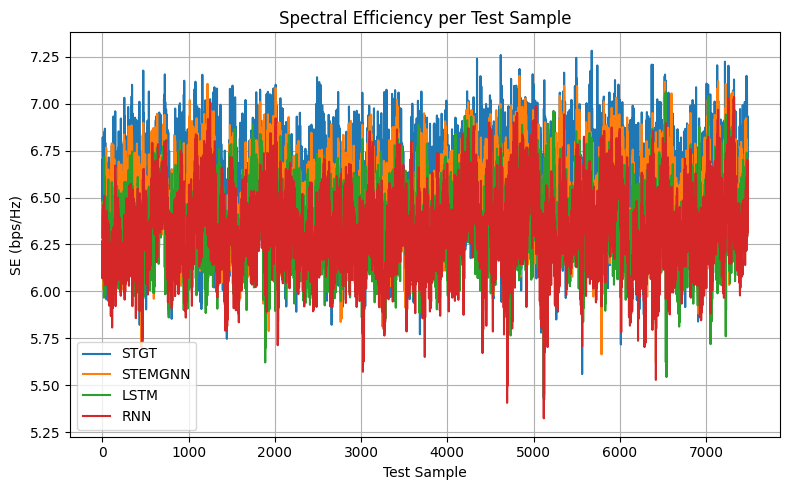
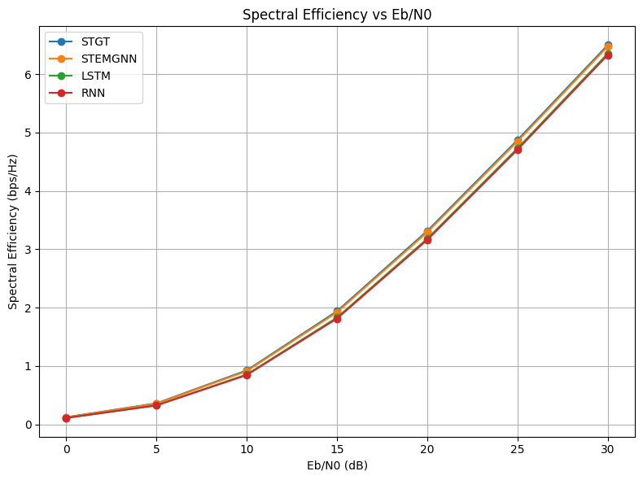

# 📡 Spectral Temporal Graph Transformer (STGT) for Massive MIMO CSI Prediction

> **IEEE Published Research** — M.Tech Dissertation, NIT Hamirpur · Sole Researcher & Author  
> Published at **IEEE IACIS-2025 International Conference**

---

## Publication

**"Spectral Temporal Graph Transformer for Massive MIMO CSI Prediction in 5G and Beyond"**  
Aftab Dayer, Dr. Sandeep Kumar Singh  
IEEE Xplore · IEEE IACIS-2025 · NIT Hamirpur, May 2025

---

## What This Research Does

Accurate Channel State Information (CSI) prediction is critical for Massive MIMO systems in 5G — but conventional methods (LSTM, RNN, MMSE) fail under high mobility and fast-fading conditions.

This work proposes **STGT**: a hybrid deep learning architecture that combines:
- **Graph Neural Networks (GNN)** — spatial dependencies among antennas via dynamically learned adjacency matrices
- **Transformer-based temporal modelling** — long-range sequential channel dynamics
- **Spectral analysis (Graph Fourier Transform)** — decomposes spatial features into frequency components
- **Encoder-decoder compression** — handles high-dimensional CSI efficiently at γ = 1/4, 1/8, 1/16

STGT consistently outperforms LSTM, RNN, and the STEM GNN baseline across all metrics and compression settings.

---

## Key Results

### Compression Ratio γ = 1/4 (512-dim)

| Model | NMSE | Correlation | SE @ 30 dB (bps/Hz) |
|-------|------|-------------|----------------------|
| **STGT (proposed)** | **0.5634** | **0.5371** | **6.615** |
| STEM GNN | 0.6168 | 0.4879 | 6.482 |
| LSTM | 0.7303 | 0.3823 | 6.300 |
| RNN | 0.6996 | 0.4059 | 6.298 |

### Compression Ratio γ = 1/8 (256-dim)

| Model | NMSE | Correlation | SE @ 30 dB (bps/Hz) |
|-------|------|-------------|----------------------|
| **STGT** | **0.5611** | **0.5277** | **6.520** |
| STEM GNN | 0.5966 | 0.4922 | 6.399 |
| LSTM | 0.7112 | 0.3856 | 6.188 |
| RNN | 0.6492 | 0.4420 | 6.324 |

### Compression Ratio γ = 1/16 (128-dim)

| Model | NMSE | Correlation | SE @ 30 dB (bps/Hz) |
|-------|------|-------------|----------------------|
| STGT | 0.5524 | 0.5388 | **6.498** |
| **STEM GNN** | **0.5285** | **0.5590** | 6.473 |
| LSTM | 0.6671 | 0.4364 | 6.352 |
| RNN | 0.6350 | 0.4624 | 6.327 |

---

## Result Plots

### Compression Ratio γ = 1/4 (512-dim latent vectors)

| Training & Validation Loss | SE per Test Sample | SE vs Eb/N0 |
|---|---|---|
|  |  |  |

### Compression Ratio γ = 1/8 (256-dim latent vectors)

| Training & Validation Loss | SE per Test Sample | SE vs Eb/N0 |
|---|---|---|
|  |  |  |

### Compression Ratio γ = 1/16 (128-dim latent vectors)

| Training & Validation Loss | SE per Test Sample | SE vs Eb/N0 |
|---|---|---|
|  |  |  |

All experiments at 120 km/h high-mobility scenario. STGT (blue) leads across SE per test sample and SE vs Eb/N0 at γ = 1/4 and 1/8.

---

## Architecture

```
Input CSI Matrix (2×32×32 complex)
        ↓
Neural Encoder → Latent Vector (512 / 256 / 128 dim)
        ↓
┌─────────────────────────────────────┐
│              STGT Model             │
│                                     │
│  Graph Construction                 │
│  (self-attention adjacency matrix)  │
│           ↓                         │
│  Graph Spectral Module (GFT)        │
│  Laplacian eigen-decomposition      │
│           ↓                         │
│  Temporal Transformer Block         │
│  Multi-head self-attention          │
│  + FFN + LayerNorm + Residual       │
│           ↓                         │
│  Fusion Layer (GLU + Residual)      │
└─────────────┬───────────────────────┘
              ↓
    Predicted Latent Vectors
              ↓
Neural Decoder → Predicted CSI Matrix
```

---

## Repository Structure

```
STGT-MassiveMIMO/
├── README.md
├── notebooks/
│   ├── 01_main_comparison_STGT_vs_baselines.ipynb   ← Start here
│   ├── 02_baseline_STEMGNN_reproduction.ipynb
│   ├── 03_csi_dataset_generation.ipynb
│   ├── 04_dataset_preprocessing.ipynb
│   ├── 05_core_thesis_experiments.ipynb
│   ├── 06_GAT_128dim_compression.ipynb
│   ├── 07_CNN_baseline_experiments.ipynb
│   ├── 08_UMA_channel_GAT_model.ipynb
│   └── 09_experimental_scratch.ipynb
└── results/
    ├── gamma_1_4_training_loss.png
    ├── gamma_1_4_SE_per_test_sample.png
    ├── gamma_1_4_SE_vs_EbN0.png
    ├── gamma_1_8_training_loss.png
    ├── gamma_1_8_SE_per_test_sample.png
    ├── gamma_1_8_SE_vs_EbN0.png
    ├── gamma_1_16_training_loss.png
    ├── gamma_1_16_SE_per_test_sample.png
    ├── gamma_1_16_SE_vs_EbN0.png
    ├── all_models_SE_vs_EbN0_comparison.png
    ├── stemgnn_training_curves.png
    ├── gat_training_curves.png
    ├── lstm_training_curves.png
    └── cnn_training_curves.png
```

---

## Notebooks Guide

| Notebook | Description | Status |
|----------|-------------|--------|
| `01_main_comparison_STGT_vs_baselines.ipynb` | Full STGT vs STEM GNN vs LSTM vs CNN — produces all key results | ✅ |
| `02_baseline_STEMGNN_reproduction.ipynb` | Reproduces the STEM GNN base paper results | ✅ |
| `03_csi_dataset_generation.ipynb` | Generates the simulated Massive MIMO CSI dataset | ✅ |
| `04_dataset_preprocessing.ipynb` | Preprocessing and compression pipeline | ✅ |
| `05_core_thesis_experiments.ipynb` | Core thesis model experiments | ✅ |
| `06_GAT_128dim_compression.ipynb` | GAT model at 128-dim compression ratio | ✅ |
| `07_CNN_baseline_experiments.ipynb` | CNN baseline implementation | ⚠️ experimental |
| `08_UMA_channel_GAT_model.ipynb` | GAT on UMA channel dataset | ⚠️ experimental |
| `09_experimental_scratch.ipynb` | Research scratch notebook | ⚠️ experimental |

> Start with `01_main_comparison_STGT_vs_baselines.ipynb` to reproduce the main paper results.

---

## Experimental Setup

| Parameter | Value |
|-----------|-------|
| Hardware | Intel Core i7-12700K · NVIDIA RTX 3070 8GB · 32GB DDR5 |
| Framework | Python 3.9 · PyTorch 1.11 |
| Dataset | Simulated Massive MIMO CSI — 160,000 channel matrices |
| Channel | H_32x72 · 120 km/h high-mobility |
| Train / Val / Test | 70% / 15% / 15% |
| Optimizer | Adam · lr=0.0002 · batch=64 · dropout=0.2 |
| Epochs | 100 |
| Compression ratios | γ = 1/4 (512-dim) · 1/8 (256-dim) · 1/16 (128-dim) |

---

## Tech Stack

`Python` · `PyTorch` · `NumPy` · `SciPy` · `Matplotlib` · `Graph Neural Networks` · `Transformer` · `Graph Fourier Transform`

---

## Why STGT Outperforms

- **Dynamic graph learning** — adjacency matrix learned per sample via self-attention, not fixed
- **Joint spatial-temporal modelling** — captures both antenna spatial dependencies and temporal evolution simultaneously
- **Spectral decomposition** — GFT separates low/high-frequency spatial patterns for richer representations
- **Robust under compression** — performance advantage widens as compression increases, showing better generalization on limited information

---

## Author

**Aftab Dayer** · [LinkedIn](https://linkedin.com/in/aftabdayer) · [GitHub](https://github.com/aftabdayer)  
M.Tech, Electronics & Communication Engineering  
National Institute of Technology Hamirpur · 2025  
Supervisor: Dr. Sandeep Kumar Singh, DoECE, NIT Hamirpur
